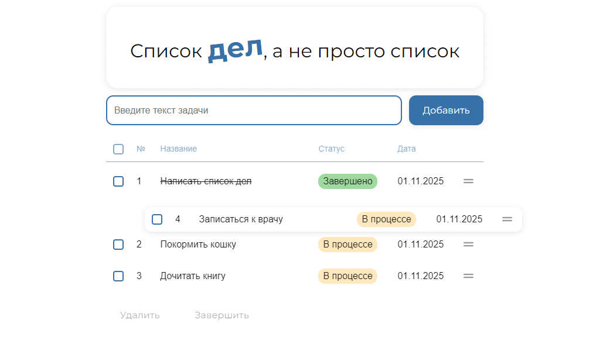

## Список дел, а не просто список
### Добавляй задачи, меняй местами, удаляй и помечай завершенные. 

## Как быстро посмотреть? 

Открой деплой: 

## Как запустить самому? 

1. Склонируй репозиторий на компьютер.
2. Установи пакеты командой `npm i`.
3. Запусти проект командой `npm run dev`.